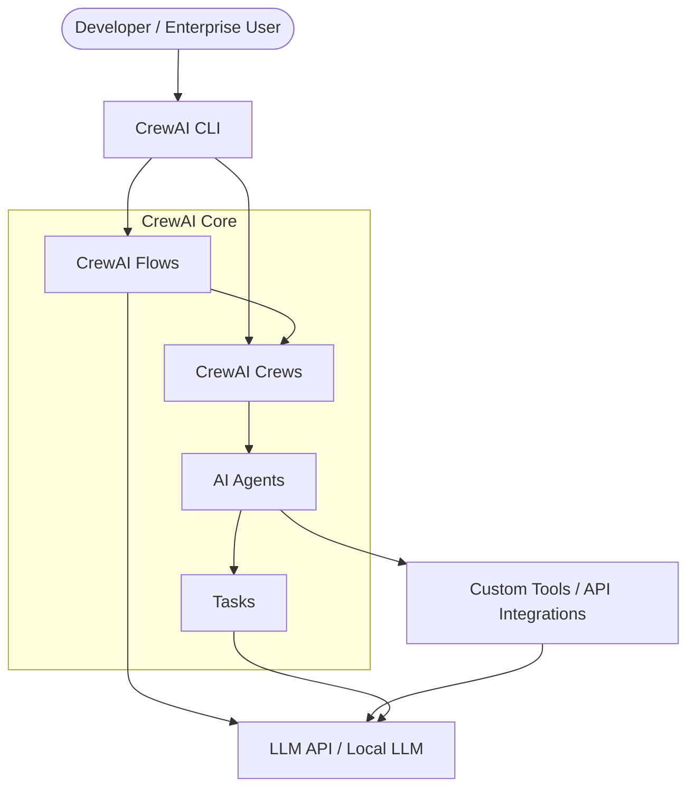

# CrewAI Architecture Decisions (ADR)

> [!NOTE]
> For the documentation workflow and standards, see [README.md](../../README.md) and [01_constitution.md](01_constitution.md).

This document captures the key architectural and design decisions for CrewAI.

---

## [ADR-001] Standalone Framework vs. Dependency-Based

### Context
Many agent frameworks (like LangChain) introduce significant boilerplate and complex state management, which can hinder performance and flexibility.

### Decision
CrewAI is built as a standalone, lean framework from scratch. It avoids heavy external dependencies to prioritize speed and low-level customization.

### Consequences
- **Pros**: 5.76x faster execution in specific QA tasks; less "framework overhead"; easier to audit and customize.
- **Cons**: Requires building core utilities that might exist in other ecosystems; fewer "out-of-the-box" integrations initially (mitigated by custom tool support).

---

## [ADR-002] Event-Driven Flow Orchestration

### Context
Static agent chains often fail in complex, real-world scenarios requiring conditional logic, branching, and secure state persistence.

### Decision
Implemented CrewAI Flows using an event-driven paradigm. This uses decorators (`@start`, `@listen`, `@router`) and Pydantic-based state management.

### Consequences
- **Pros**: Precise control over execution paths; consistent state management; clean integration with production Python code.
- **Cons**: Slightly steeper learning curve for users unfamiliar with event-driven concepts.

---

## [ADR-003] YAML-Based Configuration for Crews

### Context
Hardcoding agent definitions and task descriptions in Python makes maintenance and collaboration (especially with non-technical stakeholders) difficult.

### Decision
Supported YAML configuration for agents and tasks, while allowing programmatic overrides in `crew.py`.

### Consequences
- **Pros**: Separation of data (prompts/goals) from logic; easier customization without modifying code.
- **Cons**: Requires additional parsing logic and validation schemas.

---

## System Architecture (C4 Model)

