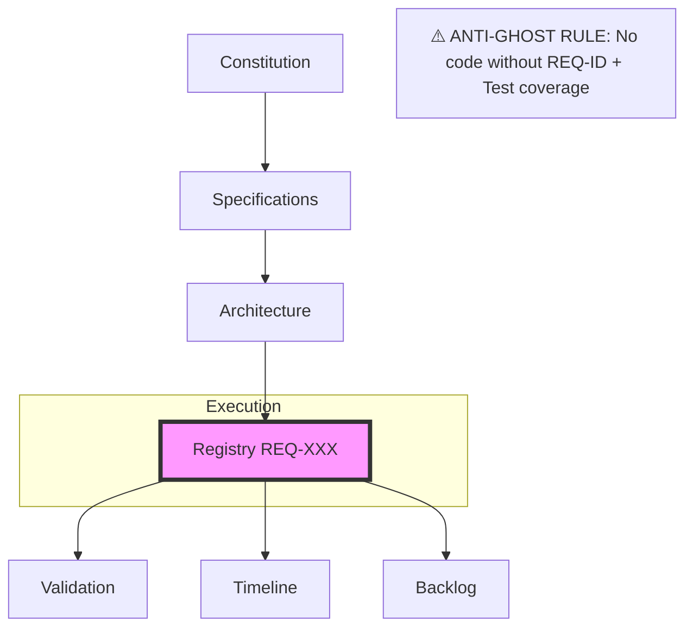

# STRIVE Project Handbook: Unified Workflow Standards

> [!TIP]
> **TL;DR:** STRIVE uses 7 documents (01–07) updated sequentially. No code exists without a Requirement ID in 04 and tests in 05.

## The Seven-Document Workflow

All development must flow through these seven specific artifacts to ensure synchronization between vision and code.

| # | Document | Primary Objective | Audience | Key Details |
| :--- | :--- | :--- | :--- | :--- |
| **01** | **Constitution** | The Engineering Soul: Non-negotiable building constraints and cultural principles. | Developers & AI Agents | Graphics-as-Code, Agent-First, Fork-on-Use, 5-Minute Rule. |
| **02** | **Specifications** | The "What" and "Why": Product vision, discovery, and high-level goals. | Stakeholders & Lead Devs | Identity hierarchy, template asset model, export strategy. |
| **03** | **Architecture** | The "How" and "Why": ADRs (Architecture Decision Records) and C4 levels. | Developers & Architects | Technical paradigms, multi-tenancy boundaries, ADR logs. |
| **04** | **Registry** | The Single Source of Truth: A verifiable list of requirement IDs and features. | QA, Devs, AI Agents | FR/UI/NAV/SEC/INT categories, status tracking. |
| **05** | **Validation** | The Verification Strategy: A suite of tests designed to cover all Registry requirements. | QA & AI Agents | Unit/Integration/E2E levels, Constitutional Audit. |
| **06** | **Timeline** | The Strategic Roadmap: Mapping requirement IDs to development phases. | Project Managers | Phased execution (Core, Structure, Scale), milestone mapping. |
| **07** | **Backlog** | The Tactical Execution: Daily tasks, current sprint focus, and blockers. | Developers | P0/P1 prioritization, mapping to Registry IDs. |

## Sequential Workflow Logic (i → i+1)

Updates must flow logically downstream. Jumping to the Backlog (07) without updating the Registry (04) is forbidden.

| Step | Action | Document |
| :--- | :--- | :--- |
| 1 | **Principle Review** — Ensure changes respect the core Constitution | Update 01 |
| 2 | **Vision Change** — If product scope shifts, update Specifications first | Update 02 |
| 3 | **Strategy Pivot** — If technical approach changes, capture it in an ADR | Update 03 |
| 4 | **Feature Refinement** — Translate vision and strategy into Requirement IDs | Update 04 |
| 5 | **Validation Proof** — Update test suites to cover new requirements | Update 05 |
| 6 | **Roadmap Impact** — Re-map new IDs to milestones and phases | Update 06 |
| 7 | **Task Action** — Break requirements into atomic tasks for execution | Update 07 |

## The Anti-Ghost Policy

> [!IMPORTANT]
> **No code shall exist that cannot be traced back to a Requirement ID in 04 and a sufficient suite of test cases in 05.**

This is the core enforcement rule of STRIVE. If code exists without traceability, it is "ghost code". All PRs must include the REQ-ID in the description.

## Maintenance & Responsibilities

### AI-Agent Integration

AI agents are primary maintainers of documentation. They must:

| Trigger | Action |
| :--- | :--- |
| **Before implementation** | Check the Registry (04) for the relevant Requirement ID |
| **Upon PR completion** | Update the Backlog (07) and Registry (04) status |
| **When ambiguity is detected** | Flag issues in Specifications (02) with `[NEEDS CLARIFICATION]` |

### Human Review

- **Monthly:** Review 01 (Constitution) to ensure engineering principles are maintained.
- **Per Milestone:** Sync all documents when a major phase (06) is reached.
- **Per PR:** Significant changes affecting 01, 02, or 03 must be highlighted.

### Requirement Verification Mapping

The STRIVE framework is successful when Validation (05) provides full coverage of the Registry (04). The Registry is not "Complete" until every ID has at least one successful verification method in Validation.

## Glossary of Terms

| Term | Definition |
| :--- | :--- |
| **STRIVE** | Synchronized Testing, Requirements, Integration, Visualization, and Engineering. |
| **ADR** | Architecture Decision Record — captures the "how" and "why" of technical choices. |
| **Registry** | The single source of truth for all verifiable requirement IDs. |
| **Ghost Code** | Code that cannot be traced to a Requirement ID — forbidden. |
| **V-Model** | The structural heart of MBSE: Decomposition (left) ↔ Integration/Verification (right). |

## The Pillars of STRIVE

### The Constitution
Establishes the "Engineering Soul" via non-negotiable standards:
- **Graphics-as-Code First**: Visuals must be derivable from declarative schemas (YAML/JSON).
- **Agent-First Rule**: Documentation must be structured for rapid AI comprehension (32k context friendly).
- **Fork-on-Use**: Prioritize decoupling templates to avoid dependency hell.
- **The 5-Minute Rule**: Any module's intent must be clear within 5 minutes of reading.

### Specifications
Defines the product vision and high-level requirements:
- **Identity Hierarchy**: Clear scoping of Users, Organizations, and Teams.
- **Asset Model**: Templates and documents treated as first-class, versioned assets.
- **Export Strategy**: Multi-format support (SVG, PDF, HTML) with varied interactivity levels.

### Architecture
Captures technical strategy and ADRs:
- **Paradigm Decisions**: Documenting the shift from WYSIWYG to code-native visualizations.
- **Security Boundaries**: Defining multi-tenancy and sandbox execution environments.
- **Visualization Resolution**: Using C4 models (System -> Container -> Component -> Code).

### Registry
The absolute source of truth for all requirements:
- **Traceable IDs**: format `[CATEGORY]-[FEATURE]-[NUMBER]` (e.g., FR-AUTH-001).
- **Categories**: Functional (FR), UI, Navigation (NAV), Security (SEC), and Integration (INT).
- **Verification Outcomes**: Explicit descriptions of what constitutes "success" for each requirement.

### Validation
The strategy for proving requirement fulfillment:
- **Verification Levels**: Unit (Logic), Integration (Interactions), E2E (Critical Paths).
- **Constitutional Audit**: AI-driven check for "No Ghost Code" and principle compliance.
- **Definition of Done**: Requirement validated only when automated tests pass and manual sign-off exists.

### Timeline
The strategic phased execution plan:
- **Phase 1 (Core)**: Product foundation (Engine MVP, Workspace, Basic Auth).
- **Phase 2 (Structure)**: Scale to teams (Organizations, Advanced Exports, Credits).
- **Phase 3 (Scale)**: Enterprise automation (Public API, SSO, Audit Logs).

### Backlog
The tactical execution list for daily development:
- **Prioritization**: Atomic tasks categorized as P0 (Critical) or P1 (High).
- **Direct Traceability**: Every backlog item must link back to a Registry (04) ID.

## Measuring Progress

STRIVE provides multiple lenses to monitor project health and development velocity:

| Metric | Source | Description |
| :--- | :--- | :--- |
| **Requirement Fulfillment** | **04 Registry** | Percentage of `[x] Done` requirements. Measures overall feature completion. |
| **Validation Coverage** | **05 Validation** | The ratio of requirements with active, passing automated tests. Measures build stability. |
| **Milestone Velocity** | **06 Timeline** | Current status against Phase (Core/Structure/Scale) targets. Measures strategic alignment. |
| **Backlog Throughput** | **07 Backlog** | Completion rate of P0/P1 tasks. Measures tactical execution speed. |
| **Architectural Stability**| **03 Architecture**| The ratio of resolved ADRs to open technical blockers. Measures design maturity. |

## Why STRIVE?

The STRIVE framework is an AI-native methodology designed to ensure that documentation and code remain a reliable, synchronized map of a project.

✅ Eliminate technical debt  
✅ Prevent "vision drift"  
✅ Ensure every line of code is verifiable against a specific requirement

---

## Quick Reference Card



---

## Appendix A: Template - Constitution

```markdown
# [Project Name] Constitution

> [!NOTE]
> For the documentation workflow and standards, see [README.md](README.md) and [strive_handbook.md](strive_handbook.md).

## Core Principles

### [Principle Name]
[Description of the principle and why it is non-negotiable.]

### The "Agent-First" Rule
All documentation and code must be structured so that an AI agent with a 32k context window can understand the module's purpose without reading the entire repository. This includes:
- Clear file headers with "Intent" and "Dependencies".
- Traceable Requirement IDs for every functional block.

### [Principle Name]
[Description of another core principle.]

## Architectural Standards

### [Standard Name]
[Technical paradigm or standard.]

### [Standard Name]
[Technical paradigm or standard.]

## Documentation Ethics

### No "Ghost" Code
Code without a corresponding Requirement ID in `04_requirements_registry.md` is considered technical debt. New features must start in `02_specifications.md` and flow downstream.

### The 5-Minute Rule
A new developer (or agent) should be able to understand the "Intent" of any file in the source directory within 5 minutes of reading its header and the relevant documentation.
```

## Appendix B: Template - Specifications

```markdown
# [Project Name] Specifications

> [!NOTE]
> For the documentation workflow and standards, see [README.md](README.md) and [01_constitution.md](01_constitution.md).

### [Tagline or Vision Statement]

**Version [X.X]** | **[Date]**

---

## Product Overview
[High-level description of the project, its purpose, and target audience.]

---

## Core Principles
* [Principle 1]
* [Principle 2]
* [Principle 3]

---

## [Feature Area 1]
### [Sub-topic]
[Details]

### [Sub-topic]
[Details]

---

## Non-Functional Requirements

| Category | Target |
| :--- | :--- |
| Performance | [Target] |
| Availability | [Target] |
| Security | [Target] |

---

## Development Phases

### Phase 1 – [Name] ([Timeframe])
- [Goal 1]
- [Goal 2]

---

## Closing Statement
[Final summary of the vision.]
```

## Appendix C: Template - Architecture Decisions (ADR)

```markdown
# [Project Name] Architecture Decisions (ADR)

> [!NOTE]
> For the documentation workflow and standards, see [README.md](README.md) and [01_constitution.md](01_constitution.md).

This document captures the key architectural and design decisions. Each entry follows the **Context - Decision - Consequences** pattern.

---

## [ADR-001] [Decision Title]

### Context
[Describe the problem or situation that led to this decision.]

### Decision
[Describe the chosen solution.]

### Consequences
- **Pros**: [Benefit 1], [Benefit 2]
- **Cons**: [Drawback 1], [Drawback 2]

---
```

## Appendix D: Template - Requirements Registry

```markdown
# [Project Name] Requirements Registry

> [!NOTE]
> For the documentation workflow and standards, see [README.md](README.md) and [01_constitution.md](01_constitution.md).

**Verifiable Requirements for Test Design**
**Version [X.X]** | **[Date]**

---

## Legend

**ID Format:** `[CATEGORY]-[FEATURE]-[NUMBER]`

**Categories:**
* **FR**: Functional Requirement
* **UI**: User Interface Requirement
* **NAV**: Navigation Requirement
* **SEC**: Security Requirement
* **INT**: Integration Requirement

**Implementation Status:**
* `[x]` **Done**: Fully implemented.
* `[/]` **In Progress**: Partially implemented.
* `[ ]` **Not Started**: Scheduled.

---

## [Requirement Group 1]

| ID | Status | Category | Requirement Description | Verifiable Outcome |
| :--- | :---: | :--- | :--- | :--- |
| [ID-001] | [ ] | [CAT] | [Description] | [Outcome] |

---

## Feature Codes
* **[CODE]**: [Description]
```

## Appendix E: Template - Validation Strategy

```markdown
# [Project Name] Validation Strategy

> [!NOTE]
> For the documentation workflow and standards, see [README.md](README.md) and [01_constitution.md](01_constitution.md).

This document defines how requirements are validated to ensure compliance with the **04_requirements_registry.md** and the **01_constitution.md**.

## Validation Levels

| Level | Method | Tool | Target |
| :--- | :--- | :--- | :--- |
| **Unit** | Automated | [Tool] | Component logic, utils, etc. |
| **Integration**| Automated | [Tool] | Component interactions. |
| **E2E** | Automated | [Tool] | Critical paths. |
| **Manual** | Human | [Tool] | UI/UX fidelity. |
| **AI-Audit** | Agent | [Tool] | Principle compliance. |

---

## Requirement Validation Mapping

### [Category 1]
- **Validation**: [Level]
- **Method**: [Description]
- **Success**: [Criteria]

---

## The "Constitutional Audit" (AI-Audit)
Before any feature is marked `[x] Done` in the registry, it must pass a Constitutional Audit:
1. **No Ghost Code**: Does every new function correlate to a Req ID in 04?
2. **Agent-First**: Can an LLM summarize this module's intent in <30 seconds?
3. **[Principle Check]**: [Description]

---

## Definition of Done (Validation)
A requirement is considered **Validated** when:
1. All associated Automated tests pass.
2. Manual verification has been signed off.
3. An AI-Audit has confirmed compliance with the **01_Constitution**.
```

## Appendix F: Template - Timeline

```markdown
# [Project Name] Development Timeline

> [!NOTE]
> For the documentation workflow and standards, see [README.md](README.md) and [01_constitution.md](01_constitution.md).

This document outlines the development roadmap, synthesizing specifications and requirements into a phased execution plan.

## Milestone Overview

| Phase | Theme | Target Date | Primary Focus |
| :--- | :--- | :--- | :--- |
| **Phase 1** | [Theme] | [Date] | [Focus] |
| **Phase 2** | [Theme] | [Date] | [Focus] |

---

## Phase 1: [Name] ([Date])
**Goal:** [Summary of Phase 1 goal.]

### Key Deliverables
- [Deliverable 1]
- [Deliverable 2]

### Requirement Mapping
| Component | Requirement IDs |
| :--- | :--- |
| [Name] | [IDs] |

---

## Release Schedule
1. **Alpha**: [Date]
2. **Beta**: [Date]
3. **GA**: [Date]
```

## Appendix G: Template - Backlog

```markdown
# [Project Name] Priority Backlog

> [!NOTE]
> For the documentation workflow and standards, see [README.md](README.md) and [01_constitution.md](01_constitution.md).

This document outlines the short-term execution plan, focusing on **P0 (Critical)** and **P1 (High)** requirements.

## Immediate Focus (High Priority)

- [ ] **[[ID]] [Title]** ([Priority])  
  *[Description of the task]*

---

*For the complete list of all requirements and their status, refer to the [Requirements Registry](04_requirements_registry.md).*
```

